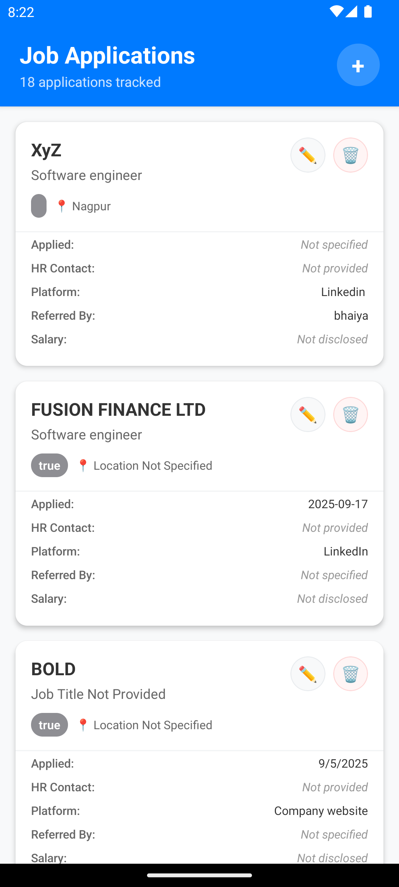
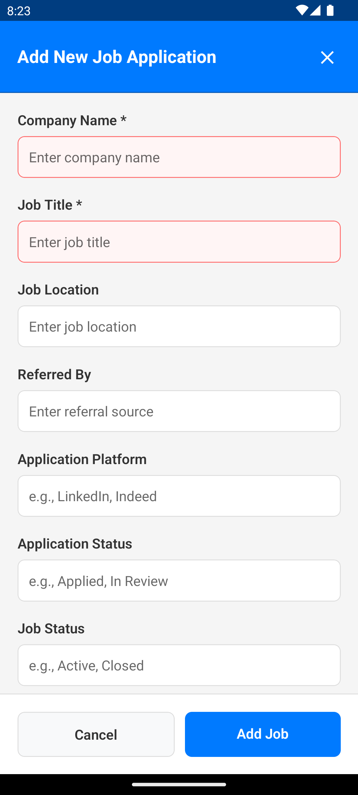
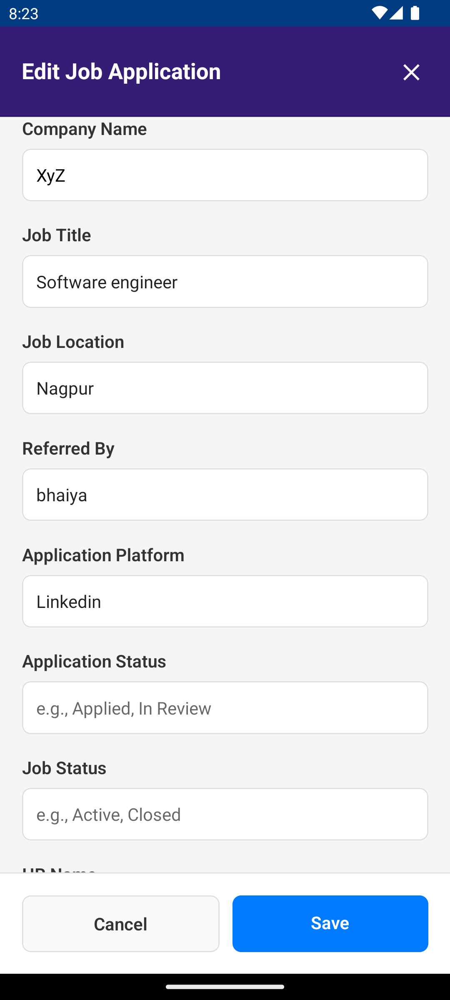

# Job Search Tracker 📱

A modern React Native mobile application for tracking job applications with Firebase Firestore integration, featuring a beautiful UI and comprehensive job management capabilities.

## 🎯 Overview
Job Search Tracker is a cross-platform mobile application built with React Native that helps users efficiently track their job applications. The app features a modern, interactive UI with Firebase Firestore backend integration for real-time data synchronization.

## ✨ Features

### 📊 **Job Management**
- **Add New Jobs**: Comprehensive form with validation for all job fields
- **Edit Jobs**: Full-featured edit modal with change tracking
- **Delete Jobs**: Safe deletion with confirmation dialogs
- **View Details**: Complete job information display with placeholders for missing data

### 🔥 **Firebase Integration**
- **Real-time Sync**: Instant data synchronization with Firestore
- **Offline Support**: Works offline with automatic sync when connected
- **Secure**: Firebase security rules and authentication ready
- **Scalable**: Cloud-based backend that scales automatically

### 📱 **Cross-Platform**
- **iOS & Android**: Native performance on both platforms
- **Responsive Design**: Adapts to different screen sizes
- **Safe Area**: Proper handling of device notches and status bars

### 🛡️ **Data Management**
- **Field Validation**: Required field validation with visual feedback
- **Change Tracking**: Tracks what fields were modified during edits
- **Error Handling**: Comprehensive error handling with user-friendly messages
- **Data Integrity**: Consistent data structure across all operations

## 🚀 Installation

### Prerequisites

- Node.js (v16 or higher)
- React Native CLI
- Android Studio (for Android development)
- Xcode (for iOS development)
- Firebase project setup

### Setup Steps

1. **Clone the repository**
   ```bash
   git clone https://github.com/prakashkrsingh09/jobSearchTracker.git
   cd jobSearchTracker
   ```

2. **Install dependencies**
   ```bash
   npm install
   ```

3. **iOS Setup (macOS only)**
   ```bash
   cd ios && pod install && cd ..
   ```

4. **Run the application**
   ```bash
   # For Android
   npm run android
   
   # For iOS
   npm run ios
   ```

## ⚙️ Configuration

### Firebase Setup

1. **Create a Firebase project** at [Firebase Console](https://console.firebase.google.com/)

2. **Enable Firestore Database**
   - Go to Firestore Database in Firebase Console
   - Create database in production mode
   - Set up security rules (start with test mode for development)

3. **Add Firebase configuration**
   - Download `google-services.json` for Android
   - Download `GoogleService-Info.plist` for iOS
   - Place them in `android/app/` and `ios/jobSearchTracker/` respectively

4. **Configure Firestore**
   - Update `src/firebase/config.js` with your project configuration
   - Set up Firestore collections structure

### Available Scripts

```bash
# Start Metro bundler
npm start

# Run on Android
npm run android

# Run on iOS
npm run ios

# Run tests
npm test

# Lint code
npm run lint

# Clean build
npm run clean
```

### Key Features Implementation

#### Job Management
- **Add Job**: `AddJobModal` component with form validation
- **Edit Job**: `EditJobModal` with change tracking
- **Delete Job**: Confirmation dialog with safe deletion
- **View Jobs**: Card-based layout with status indicators

#### Firebase Integration
- **CRUD Operations**: Complete Create, Read, Update, Delete functionality
- **Real-time Updates**: Automatic data synchronization
- **Error Handling**: Comprehensive error management
- **Offline Support**: Works without internet connection

## 📱 Screenshots

### Main Job List Screen

*Clean, modern job list with status badges and interactive cards*

### Add New Job Modal

*Comprehensive form for adding new job applications with validation*

### Edit Job Modal

*Full-featured editing interface with change tracking*

## 🚀 Deployment

### Android
1. Generate signed APK
2. Upload to Google Play Store
3. Configure Firebase for production

### iOS
1. Archive the app in Xcode
2. Upload to App Store Connect
3. Configure Firebase for production

## 📄 License

This project is licensed under the MIT License - see the [LICENSE](LICENSE) file for details.

## 🙏 Acknowledgments

- React Native community for excellent documentation
- Firebase team for robust backend services
- Contributors who helped improve the project

## 📞 Support

For support, 
- Email prakashkumarsingh1994@outlook.com
- Mobile +91-7903239967
- create an issue in the repository.

---

**Made with ❤️ using React Native and Firebase**

---

### 📚 Technical Overview

For a deeper, engineering-focused explanation of the architecture, data model, and core flows, see:

- [`docs/TechnicalOverview.md`](./docs/TechnicalOverview.md)